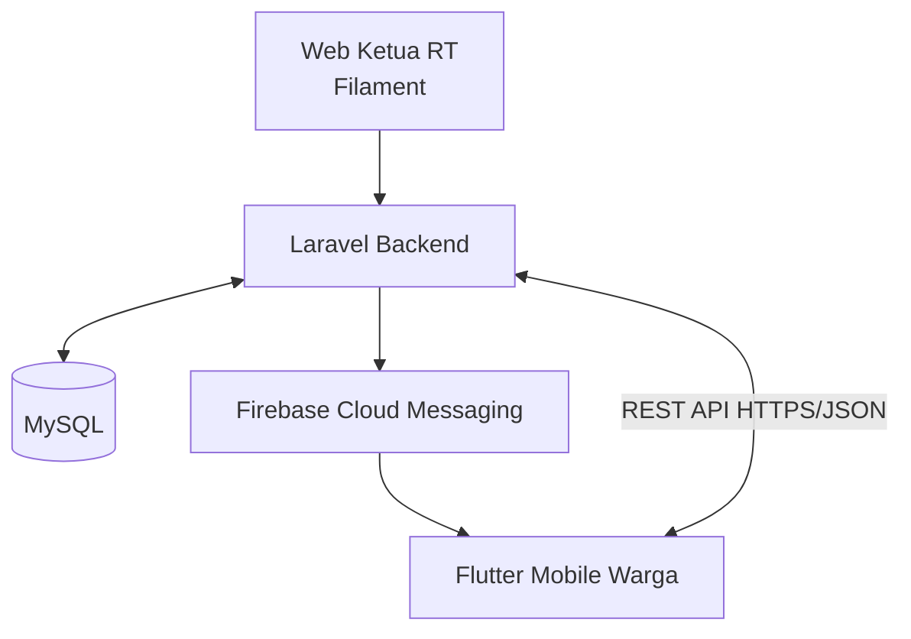
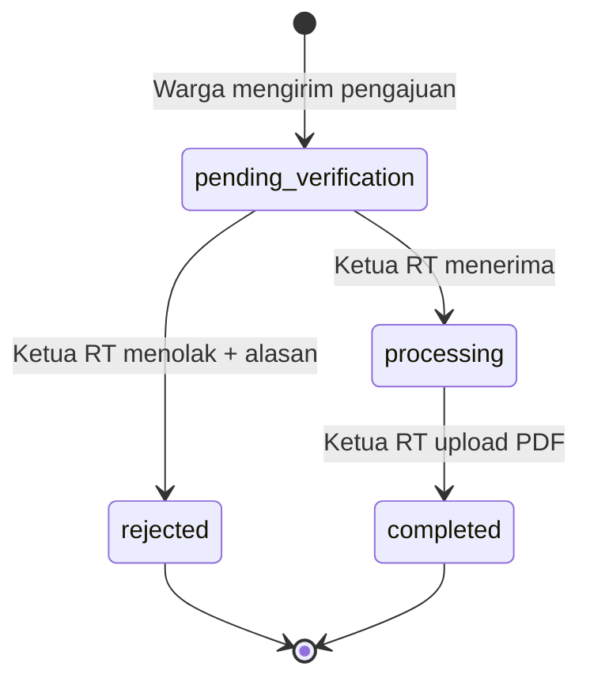
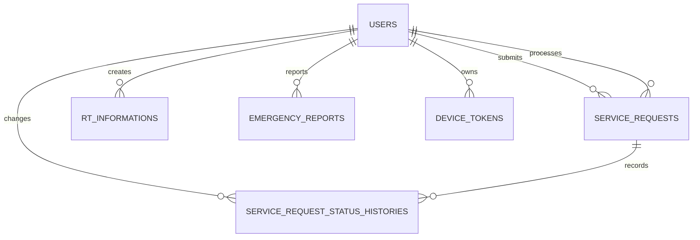

# Warga 20

Sistem Pelayanan Masyarakat RT 20 Berbasis Web dan Mobile

> Dokumentasi teknis utama untuk backend Laravel, REST API aplikasi mobile warga, dan panel administrasi Ketua RT berbasis Filament.

| Informasi | Nilai |
| --- | --- |
| Studi kasus | Teratai Griya Asri RT 20, Legok |
| Backend dan REST API | Laravel |
| Panel web Ketua RT | Filament pada Raugadh Fila Starter |
| Aplikasi mobile warga | Flutter Android - dikembangkan sebagai client terpisah |
| Database | MySQL terpusat |
| Autentikasi mobile | Laravel Sanctum Bearer Token |
| Role dan permission | Spatie Laravel Permission + Filament Shield |
| Push notification | Firebase Cloud Messaging - belum selesai diimplementasikan |
| Arsitektur | Client-server, HTTPS/JSON |
| Baseline kebutuhan | PRD Warga 20 Final Development Baseline v1.1 |
| Tanggal dokumentasi | 18 Agustus 2026 |

> Catatan versi: nama berkas sumber adalah `PRD_Warga_20_v1.0 (PRD).pdf`, tetapi isi dokumen secara eksplisit menetapkan **Final Development Baseline v1.1**. Dokumentasi ini mengikuti isi baseline v1.1.

---

## Daftar Isi

1. [Ringkasan](#ringkasan)
2. [Konteks Cepat untuk Developer atau AI](#konteks-cepat-untuk-developer-atau-ai)
3. [Status Implementasi](#status-implementasi)
4. [Ruang Lingkup](#ruang-lingkup)
5. [Arsitektur Sistem](#arsitektur-sistem)
6. [Aktor, Role, dan Hak Akses](#aktor-role-dan-hak-akses)
7. [Aturan Bisnis](#aturan-bisnis)
8. [Alur Utama Sistem](#alur-utama-sistem)
9. [Teknologi dan Dependensi](#teknologi-dan-dependensi)
10. [Struktur Project](#struktur-project)
11. [Database dan Model](#database-dan-model)
12. [REST API Mobile Warga](#rest-api-mobile-warga)
13. [Panel Filament Ketua RT](#panel-filament-ketua-rt)
14. [Penyimpanan File](#penyimpanan-file)
15. [Instalasi dan Konfigurasi](#instalasi-dan-konfigurasi)
16. [Pembuatan Akun dan Role](#pembuatan-akun-dan-role)
17. [Cara Menjalankan dan Menggunakan Sistem](#cara-menjalankan-dan-menggunakan-sistem)
18. [Integrasi Flutter](#integrasi-flutter)
19. [Testing](#testing)
20. [Deployment dan Keamanan Production](#deployment-dan-keamanan-production)
21. [Maintenance](#maintenance)
22. [Troubleshooting](#troubleshooting)
23. [Pekerjaan Lanjutan](#pekerjaan-lanjutan)
24. [Out of Scope](#out-of-scope)
25. [Panduan Handover ke Developer atau GPT Lain](#panduan-handover-ke-developer-atau-gpt-lain)

---

## Ringkasan

Warga 20 adalah sistem pelayanan masyarakat untuk lingkungan Teratai Griya Asri RT 20, Legok. Sistem menghubungkan dua client ke satu backend dan database yang sama:

- Ketua RT menggunakan panel web Filament sebagai administrator utama.
- Warga menggunakan aplikasi Flutter Android melalui REST API Laravel.
- Semua data disimpan di MySQL terpusat.
- Laravel menangani autentikasi, validasi, authorization, business logic, file privat, dan integrasi notifikasi.
- Firebase Cloud Messaging atau FCM direncanakan khusus untuk perubahan status pelayanan dan laporan darurat.

Fitur utama sistem adalah:

- pengelolaan satu akun untuk satu rumah;
- informasi dan pengumuman RT;
- pengajuan pelayanan administrasi tanpa master jenis surat;
- verifikasi dan monitoring status pelayanan;
- dokumen hasil pelayanan dalam format PDF;
- laporan keadaan darurat tanpa approval;
- nomor penting;
- profil warga;
- registrasi device token FCM;
- dashboard dan administrasi Ketua RT.

Project ini berfokus pada **backend dan panel admin**. Aplikasi Flutter adalah consumer REST API dan tidak berada dalam paket kode yang didokumentasikan di repository ini.

---

## Konteks Cepat untuk Developer atau AI

Bagian ini adalah ringkasan yang wajib dibaca sebelum mengubah kode.

### Identitas project

- Nama: **Warga 20**.
- Wilayah: **Teratai Griya Asri RT 20, Legok**.
- Admin web: hanya **Ketua RT**.
- Client warga: **Flutter Android**.
- Akun warga: **satu rumah satu akun**.
- Registrasi mandiri: **tidak tersedia**.
- Akun warga hanya dibuat atau direset oleh Ketua RT melalui Filament.
- Login warga menggunakan `username` dan `password`, bukan email.
- Role tidak disimpan dalam kolom `users.role`; role dikelola oleh Spatie Permission.

### Keputusan desain yang tidak boleh diubah tanpa persetujuan

- Role utama adalah `ketua_rt` dan `warga`.
- `house_code` unik menjadi pengaman aturan satu rumah satu akun.
- Warga tidak boleh mengubah `name`, `username`, `house_code`, atau `address` melalui API.
- Warga hanya boleh mengubah `email`, `phone`, dan `password`.
- Pengajuan pelayanan menggunakan teks bebas `purpose`; tidak ada master jenis surat.
- Status awal pelayanan selalu `pending_verification`.
- Status hanya dapat berubah melalui alur yang diizinkan.
- Penolakan wajib memiliki alasan.
- Penyelesaian wajib memiliki PDF hasil.
- Lampiran dan PDF hasil harus privat.
- Warga hanya dapat membaca pengajuan dan file miliknya sendiri.
- Laporan darurat langsung disimpan tanpa approval.
- Pengumuman RT tidak otomatis mengirim FCM pada baseline penelitian.
- FCM bukan database; MySQL tetap menjadi sumber data utama.

### Batas tanggung jawab setiap interface

| Interface | Pengguna | Tanggung jawab |
| --- | --- | --- |
| Filament `/admin` | Ketua RT | CRUD warga, informasi, nomor penting; verifikasi pelayanan; upload PDF; monitoring darurat |
| REST API `/api/v1` | Flutter warga | Login, profil, informasi, pelayanan milik sendiri, laporan milik sendiri, nomor penting, device token |
| MySQL | Backend | Sumber data utama dan riwayat status |
| FCM | Backend ke Flutter | Pengiriman push notification; implementasi listener/service masih pending |

### Kondisi implementasi saat README dibuat

- Migration dan model domain tersedia.
- REST API v1 untuk mobile warga tersedia.
- Filament Resource dan dashboard widget tersedia.
- Event `EmergencyReportCreated` tersedia sebagai integration point.
- Service/listener FCM belum tersedia.
- Event perubahan status pelayanan untuk FCM belum tersedia.
- Flutter tidak termasuk repository ini.
- Automated feature test, factory domain, dan seeder demo belum termasuk paket saat ini.

---

## Status Implementasi

Gunakan tabel ini untuk membedakan kode yang sudah tersedia dari kebutuhan yang belum selesai.

| Area | Status | Keterangan |
| --- | --- | --- |
| Migration domain | Tersedia | 7 migration: ekstensi `users` dan 6 tabel domain |
| Model Eloquent | Tersedia | 7 model termasuk pengganti `User` starter |
| Enum status dan darurat | Tersedia | `ServiceRequestStatus` dan `EmergencyType` |
| Sanctum mobile auth | Tersedia | Login, me, logout, token ability `mobile:warga` |
| Role dan panel access | Tersedia | Hanya akun aktif dengan role `ketua_rt` yang dapat masuk Filament |
| REST API v1 | Tersedia | Endpoint warga tanpa registrasi publik dan tanpa endpoint admin |
| Private file authorization | Tersedia | Download lampiran/PDF dibatasi ke pemilik pengajuan |
| Filament Data Warga | Tersedia | CRUD, aktivasi, nonaktivasi, reset password |
| Filament Informasi RT | Tersedia | Draf, terjadwal, terbit, gambar publik |
| Filament Pelayanan | Tersedia | Proses, tolak, selesaikan, PDF privat, timeline |
| Filament Laporan Darurat | Tersedia | Read-only, polling 15 detik |
| Filament Nomor Penting | Tersedia | CRUD dan status aktif |
| Dashboard Filament | Tersedia | Statistik dan tabel aktivitas terbaru |
| Postman collection | Tersedia | Collection API v1 |
| Pengiriman FCM darurat | Belum | Event sudah ada, listener/service Firebase belum dibuat |
| Pengiriman FCM status pelayanan | Belum | Perlu event setelah transaksi status berhasil commit |
| Flutter Android | Di luar repository | Dibangun sebagai project client terpisah |
| Inbox notifikasi internal | Opsional/P1 | Bukan syarat MVP |
| Automated test lengkap | Belum | Skenario black-box dan rekomendasi test dijelaskan di README |

---

## Ruang Lingkup

### Termasuk dalam MVP

- autentikasi Ketua RT di web;
- autentikasi warga dengan Sanctum;
- pembuatan dan pengelolaan akun warga oleh Ketua RT;
- informasi RT;
- pengajuan pelayanan administrasi;
- verifikasi, penolakan, proses, dan penyelesaian pelayanan;
- riwayat perubahan status;
- upload dan download dokumen hasil PDF;
- laporan keadaan darurat;
- nomor penting;
- profil warga;
- registrasi dan penghapusan device token;
- push notification FCM untuk status dan laporan darurat setelah modul FCM selesai;
- dashboard statistik sederhana.

### Tidak termasuk dalam backend mobile

- endpoint registrasi publik;
- endpoint untuk warga mengubah status pelayanan;
- endpoint untuk warga mengunggah dokumen hasil;
- endpoint admin terpisah;
- master jenis surat;
- approval laporan darurat.

Aktivitas admin dilakukan langsung melalui Filament dan menggunakan model/database yang sama.

---

## Arsitektur Sistem



### Penjelasan komponen

| Komponen | Fungsi |
| --- | --- |
| Laravel | Business logic, autentikasi, authorization, validasi, API, file access, event |
| Filament | Antarmuka administrator Ketua RT |
| MySQL | Penyimpanan terpusat untuk user, informasi, pelayanan, darurat, kontak, token |
| Sanctum | Personal access token untuk aplikasi Flutter |
| Spatie Permission | Role dan permission web |
| Filament Shield | Integrasi permission ke resource/page Filament |
| Flutter | Client Android warga |
| FCM | Kanal push notification, bukan sumber data |

### Boundary keamanan

- Endpoint API publik hanya `POST /api/v1/auth/login`.
- Endpoint lain memerlukan `auth:sanctum` dan middleware `EnsureActiveWarga`.
- Panel Filament memanggil `User::canAccessPanel()`.
- Query pelayanan dan laporan darurat dari API selalu di-scope menggunakan user yang login.
- File privat tidak boleh dipublikasikan melalui `storage:link`.

---

## Aktor, Role, dan Hak Akses

### Role `ketua_rt`

Ketua RT adalah administrator web utama.

- login ke panel `/admin`;
- melihat dashboard;
- membuat, melihat, mengubah, mengaktifkan, dan menonaktifkan akun warga;
- reset password warga;
- membuat, mengubah, melihat, dan menghapus informasi RT;
- melihat semua pengajuan pelayanan;
- memproses atau menolak pengajuan;
- menyelesaikan pengajuan dengan PDF;
- melihat timeline status;
- melihat semua laporan darurat;
- mengelola nomor penting.

Syarat akses panel:

```php
return $this->is_active && $this->hasRole('ketua_rt');
```

### Role `warga`

Warga hanya menggunakan API mobile.

- login menggunakan username dan password;
- melihat profil;
- mengubah email, phone, dan password;
- melihat informasi yang sudah terbit;
- membuat serta melihat pengajuan miliknya sendiri;
- mengunduh lampiran dan PDF hasil miliknya sendiri;
- membuat serta melihat laporan darurat miliknya sendiri;
- melihat nomor penting aktif;
- mendaftarkan dan menghapus device token.

### Matriks authorization

| Aksi | Ketua RT | Warga |
| --- | ---: | ---: |
| Registrasi publik | Tidak | Tidak |
| Membuat akun warga | Ya | Tidak |
| Mengubah nama/alamat/kode rumah warga | Ya | Tidak |
| Mengubah email/telepon sendiri | Melalui admin | Ya |
| Membuat informasi RT | Ya | Tidak |
| Membaca informasi terbit | Ya | Ya |
| Membuat pengajuan pelayanan | Tidak dari Filament | Ya |
| Mengubah status pelayanan | Ya | Tidak |
| Upload PDF hasil | Ya | Tidak |
| Membaca PDF pelayanan orang lain | Ya sebagai admin | Tidak |
| Membuat laporan darurat | Tidak dari Filament | Ya |
| Approval laporan darurat | Tidak ada | Tidak ada |
| Kelola nomor penting | Ya | Tidak |

---

## Aturan Bisnis

1. Satu rumah hanya memiliki satu akun warga.
2. Akun warga dibuat oleh Ketua RT; aplikasi mobile tidak menyediakan registrasi mandiri.
3. Warga login menggunakan `username` dan `password`.
4. `username` dan `house_code` wajib serta unik untuk akun warga.
5. Kolom tersebut nullable di database hanya agar migration aman terhadap akun admin starter yang sudah ada.
6. Password disimpan menggunakan hash melalui cast `hashed` pada model `User`.
7. Role disimpan pada tabel Spatie Permission, bukan pada kolom `users.role`.
8. Nama, alamat, username, dan kode rumah dikendalikan Ketua RT.
9. Warga dapat mengubah email, nomor telepon, dan password sendiri.
10. Pengajuan pelayanan menggunakan `purpose` berupa teks bebas.
11. Pengajuan baru selalu berstatus `pending_verification`.
12. Hanya Ketua RT yang dapat memutuskan atau mengubah status pelayanan.
13. Status hanya dapat berpindah sesuai state machine.
14. Penolakan wajib menyimpan alasan di `admin_note` dan history.
15. Penyelesaian wajib mengunggah file PDF maksimal 5 MB.
16. Perubahan status disimpan dalam transaksi database dan dicatat pada timeline immutable.
17. Lampiran warga hanya JPG/JPEG/PNG maksimal 5 MB.
18. Warga hanya dapat mengakses pelayanan dan file milik akun sendiri.
19. Laporan darurat langsung disimpan dan tidak memiliki status approval.
20. Event notifikasi harus dijalankan setelah data utama berhasil tersimpan.
21. Pengirim laporan darurat harus dikecualikan dari penerima FCM laporan tersebut.
22. Informasi RT tidak otomatis mengirim FCM pada baseline.
23. Device token harus dihapus saat logout untuk mencegah notifikasi salah pengguna.
24. MySQL adalah sumber kebenaran utama; FCM hanya kanal pengiriman.

---

## Alur Utama Sistem

### Lifecycle pelayanan



| Code database/API | Label UI | Terminal | Transisi berikutnya |
| --- | --- | ---: | --- |
| `pending_verification` | Menunggu Verifikasi | Tidak | `processing`, `rejected` |
| `processing` | Diproses | Tidak | `completed` |
| `rejected` | Ditolak | Ya | Tidak ada |
| `completed` | Selesai | Ya | Tidak ada |

Tidak tersedia transisi mundur, reopen, atau edit status bebas. Jika kebutuhan tersebut muncul, ubah enum, aturan transaksi, UI Filament, test, dan dokumentasi secara bersamaan.

### Alur laporan darurat

1. Warga login.
2. Warga memilih kategori dan mengisi deskripsi.
3. API memvalidasi input.
4. Record disimpan ke `emergency_reports`.
5. Event `EmergencyReportCreated` dikirim.
6. Listener FCM yang akan dibuat harus mengambil device token aktif seluruh warga aktif kecuali pengirim.
7. Ketua RT dapat melihat laporan di Filament tanpa approval.

### Alur akun warga

1. Ketua RT memverifikasi data rumah.
2. Ketua RT membuat akun pada menu Data Warga.
3. Filament memberikan role `warga` secara otomatis.
4. Ketua RT memberikan username dan password awal kepada warga melalui kanal aman.
5. Warga login dari Flutter.
6. Flutter mendaftarkan FCM device token.
7. Warga dapat mengganti password; token sesi lain akan dicabut.
8. Jika lupa password, Ketua RT melakukan reset melalui Filament.

---

## Teknologi dan Dependensi

### Versi lingkungan yang terlihat saat pengembangan

| Komponen | Versi/keterangan |
| --- | --- |
| PHP | 8.5.9 pada screenshot server |
| Laravel | 13.12.0 pada screenshot server |
| Raugadh Fila Starter | Struktur starter 4.x |
| Filament | Struktur kode Filament 5.x |
| Database | MySQL |
| Web server | Deployment berbasis Docker; Laravel root `/var/www/html` |

Jangan menjadikan tabel tersebut sebagai satu-satunya sumber versi. Versi aktual harus diperiksa dari lockfile/container:

```bash
php -v
php artisan about
composer show filament/filament
composer show laravel/sanctum
composer show spatie/laravel-permission
composer show bezhansalleh/filament-shield
```

### Package wajib

- `laravel/framework`
- `laravel/sanctum`
- `filament/filament`
- `spatie/laravel-permission`
- `bezhansalleh/filament-shield`

Package FCM belum ditetapkan dalam kode saat ini. Pilih satu strategi resmi dan konsisten ketika modul FCM diimplementasikan, lalu dokumentasikan credential, queue, retry, dan invalid-token cleanup tanpa memasukkan secret ke repository.

---

## Struktur Project

Struktur berikut hanya menampilkan file/folder yang relevan. Folder Laravel standar seperti `bootstrap`, `config`, `resources`, `storage`, `tests`, dan `vendor` tetap ada.

```text
.
├── app
│   ├── Enums
│   │   ├── EmergencyType.php
│   │   └── ServiceRequestStatus.php
│   ├── Events
│   │   └── EmergencyReportCreated.php
│   ├── Filament
│   │   └── Admin
│   │       ├── Resources
│   │       │   ├── EmergencyReports
│   │       │   ├── ImportantContacts
│   │       │   ├── RtInformations
│   │       │   ├── ServiceRequests
│   │       │   └── Warga
│   │       └── Widgets
│   │           ├── RecentEmergencyReports.php
│   │           ├── RecentServiceRequests.php
│   │           └── Warga20StatsOverview.php
│   ├── Http
│   │   ├── Controllers
│   │   │   └── Api
│   │   │       └── V1
│   │   ├── Middleware
│   │   │   ├── EnsureActiveWarga.php
│   │   │   └── HandleApiExceptions.php
│   │   ├── Requests
│   │   │   └── Api
│   │   │       └── V1
│   │   └── Resources
│   │       └── Api
│   │           └── V1
│   └── Models
│       ├── DeviceToken.php
│       ├── EmergencyReport.php
│       ├── ImportantContact.php
│       ├── RtInformation.php
│       ├── ServiceRequest.php
│       ├── ServiceRequestStatusHistory.php
│       └── User.php
├── database
│   └── migrations
│       ├── 2026_08_18_210001_extend_users_table_for_warga20.php
│       ├── 2026_08_18_210002_create_rt_informations_table.php
│       ├── 2026_08_18_210003_create_service_requests_table.php
│       ├── 2026_08_18_210004_create_service_request_status_histories_table.php
│       ├── 2026_08_18_210005_create_emergency_reports_table.php
│       ├── 2026_08_18_210006_create_important_contacts_table.php
│       └── 2026_08_18_210007_create_device_tokens_table.php
├── postman
│   └── Warga20_API_v1.postman_collection.json
├── routes
│   └── api.php
├── .env
├── artisan
├── composer.json
├── composer.lock
└── README.md
```

### Tanggung jawab folder custom

| Lokasi | Tanggung jawab |
| --- | --- |
| `app/Enums` | Nilai enum dan label yang dipakai database, API, dan Filament |
| `app/Events` | Integration point event domain, saat ini laporan darurat |
| `app/Filament/Admin/Resources` | CRUD, tabel, form, infolist, aksi admin |
| `app/Filament/Admin/Widgets` | Statistik dan aktivitas dashboard |
| `app/Http/Controllers/Api/V1` | Orkestrasi request/response mobile |
| `app/Http/Requests/Api/V1` | Authorization request dan validasi input |
| `app/Http/Resources/Api/V1` | Kontrak output JSON |
| `app/Http/Middleware` | Guard akun warga dan normalisasi exception API |
| `app/Models` | Entity Eloquent, relasi, scope, cast |
| `database/migrations` | Schema dan constraint database |
| `routes/api.php` | Endpoint versi `/api/v1` |
| `postman` | Collection untuk pengujian manual API |

### Pola folder Filament

Setiap resource mengikuti pola modular Filament 5:

```text
ResourceName/
├── Pages/
├── Schemas/
├── Tables/
├── RelationManagers/     # jika dibutuhkan
├── Actions/              # jika dibutuhkan
└── ResourceNameResource.php
```

Resource dan widget ditemukan otomatis oleh `discoverResources()` serta `discoverWidgets()` pada `AdminPanelProvider`.

---

## Database dan Model

### Entity relationship



`IMPORTANT_CONTACTS` tidak memiliki foreign key ke user pada schema saat ini.

### `users`

Tabel berasal dari starter Raugadh, kemudian ditambah field Warga 20.

| Field tambahan | Tipe | Null | Constraint/index | Fungsi |
| --- | --- | ---: | --- | --- |
| `username` | `varchar(100)` | Ya | Unique | Identifier login mobile |
| `house_code` | `varchar(50)` | Ya | Unique | Kode unik satu rumah |
| `address` | `text` | Ya | - | Alamat rumah |
| `phone` | `varchar(30)` | Ya | - | Kontak warga |
| `is_active` | `boolean` | Tidak | Default `true`, index | Mengizinkan/menolak login |

Nullable pada `username` dan `house_code` hanya untuk kompatibilitas akun admin starter. Form Filament mewajibkan kedua field untuk warga.

Model `User`:

- memakai `HasApiTokens`, `HasRoles`, `HasFactory`, dan `Notifiable`;
- mempertahankan dukungan avatar Filament;
- password memakai cast `hashed`;
- hanya akun aktif ber-role `ketua_rt` dapat mengakses panel;
- menyediakan scope `active()`, `warga()`, dan `ketuaRt()`;
- mempunyai relasi ke pengajuan, history, informasi, darurat, dan device token.

### `rt_informations`

| Field | Tipe | Null | Constraint/index | Fungsi |
| --- | --- | ---: | --- | --- |
| `id` | bigint | Tidak | PK | ID informasi |
| `title` | varchar | Tidak | - | Judul |
| `content` | longtext | Tidak | - | Isi HTML dari RichEditor |
| `image_path` | varchar | Ya | - | Path gambar pada disk `public` |
| `published_at` | timestamp | Ya | Index | Null=draf, masa depan=terjadwal, lampau=terbit |
| `created_by` | bigint | Ya | FK users, null on delete | Pembuat informasi |
| `created_at` | timestamp | Ya | - | Waktu dibuat |
| `updated_at` | timestamp | Ya | - | Waktu diperbarui |
| `deleted_at` | timestamp | Ya | Soft delete | Penghapusan logis |

Scope `published()` hanya mengambil record dengan `published_at <= now()`.

### `service_requests`

| Field | Tipe | Null | Constraint/index | Fungsi |
| --- | --- | ---: | --- | --- |
| `id` | bigint | Tidak | PK | ID internal |
| `request_number` | `varchar(40)` | Tidak | Unique | Nomor publik `PEL-{ULID}` |
| `user_id` | bigint | Tidak | FK users, restrict delete | Pemilik pengajuan |
| `purpose` | varchar | Tidak | - | Keperluan pelayanan |
| `description` | text | Ya | - | Keterangan warga |
| `attachment_path` | varchar | Ya | - | Lampiran privat |
| `status` | `varchar(30)` | Tidak | Default pending, index | Enum lifecycle |
| `admin_note` | text | Ya | - | Catatan/alasan Ketua RT |
| `result_document_path` | varchar | Ya | - | PDF hasil privat |
| `processed_by` | bigint | Ya | FK users, null on delete | Admin pemroses |
| `submitted_at` | timestamp | Tidak | Default current | Waktu pengajuan |
| `processed_at` | timestamp | Ya | - | Waktu mulai proses |
| `rejected_at` | timestamp | Ya | - | Waktu ditolak |
| `completed_at` | timestamp | Ya | - | Waktu selesai |
| `created_at` | timestamp | Ya | - | Timestamp Laravel |
| `updated_at` | timestamp | Ya | - | Timestamp Laravel |

Index tambahan:

- `user_id + status`;
- `status + submitted_at`.

### `service_request_status_histories`

| Field | Tipe | Null | Constraint/index | Fungsi |
| --- | --- | ---: | --- | --- |
| `id` | bigint | Tidak | PK | ID history |
| `service_request_id` | bigint | Tidak | FK, cascade delete | Pengajuan induk |
| `changed_by` | bigint | Ya | FK users, null on delete | Aktor perubahan |
| `old_status` | `varchar(30)` | Ya | - | Null pada pembuatan awal |
| `new_status` | `varchar(30)` | Tidak | - | Status baru |
| `note` | text | Ya | - | Catatan perubahan |
| `created_at` | timestamp | Tidak | Default current, composite index | Waktu perubahan |

Tabel ini sengaja tidak memiliki `updated_at`. History diperlakukan sebagai immutable audit timeline.

### `emergency_reports`

| Field | Tipe | Null | Constraint/index | Fungsi |
| --- | --- | ---: | --- | --- |
| `id` | bigint | Tidak | PK | ID laporan |
| `user_id` | bigint | Tidak | FK users, restrict delete | Pelapor |
| `emergency_type` | `varchar(50)` | Tidak | Index | Enum kategori |
| `description` | text | Tidak | - | Keterangan kejadian |
| `reported_at` | timestamp | Tidak | Default current | Waktu laporan |
| `created_at` | timestamp | Ya | - | Timestamp Laravel |
| `updated_at` | timestamp | Ya | - | Timestamp Laravel |

Tidak ada field status atau approval.

Nilai `emergency_type`:

| Code | Label |
| --- | --- |
| `fire` | Kebakaran |
| `illness_or_accident` | Sakit/Kecelakaan |
| `theft` | Pencurian |
| `crime` | Tindak Kejahatan |
| `death` | Kematian |
| `other` | Keadaan Darurat Lainnya |

### `important_contacts`

| Field | Tipe | Null | Constraint/index | Fungsi |
| --- | --- | ---: | --- | --- |
| `id` | bigint | Tidak | PK | ID kontak |
| `name` | varchar | Tidak | - | Nama kontak/instansi |
| `category` | `varchar(100)` | Tidak | Composite index | Kategori |
| `phone_number` | `varchar(30)` | Tidak | - | Nomor telepon |
| `description` | text | Ya | - | Keterangan |
| `is_active` | boolean | Tidak | Default true, composite index | Tampil di mobile |
| `created_at` | timestamp | Ya | - | Timestamp Laravel |
| `updated_at` | timestamp | Ya | - | Timestamp Laravel |
| `deleted_at` | timestamp | Ya | Soft delete | Penghapusan logis |

### `device_tokens`

| Field | Tipe | Null | Constraint/index | Fungsi |
| --- | --- | ---: | --- | --- |
| `id` | bigint | Tidak | PK | ID token |
| `user_id` | bigint | Tidak | FK users, cascade delete | Pemilik token |
| `token` | `varchar(512)` | Tidak | Unique | Token FCM |
| `platform` | `varchar(20)` | Tidak | Default android | `android` atau `ios` |
| `is_active` | boolean | Tidak | Default true, composite index | Kelayakan penerima |
| `last_seen_at` | timestamp | Ya | - | Terakhir diregistrasikan |
| `created_at` | timestamp | Ya | - | Timestamp Laravel |
| `updated_at` | timestamp | Ya | - | Timestamp Laravel |

Satu user dapat mempunyai lebih dari satu device token. Token yang sama di-update atau dipindahkan ke user terakhir yang meregistrasikannya.

### Tabel package/starter yang digunakan

Migration custom tidak membuat ulang tabel berikut karena berasal dari Laravel/Raugadh/package:

- `personal_access_tokens` dari Sanctum;
- `roles`, `permissions`, dan pivot Spatie;
- tabel session/cache/job sesuai konfigurasi starter;
- `notifications` bila tersedia di starter, tetapi inbox internal belum dipakai;
- `activity_log` bila logger starter terpasang.

---

## REST API Mobile Warga

### Base URL

```text
https://noval.djncloud.my.id/api/v1
```

Untuk local development, sesuaikan dengan `APP_URL`, misalnya:

```text
http://localhost/api/v1
```

### Header umum

Endpoint JSON:

```http
Accept: application/json
Content-Type: application/json
```

Endpoint terproteksi:

```http
Accept: application/json
Authorization: Bearer TOKEN_SANCTUM
```

Upload lampiran menggunakan `multipart/form-data`; jangan mengatur boundary secara manual pada Flutter/Postman.

### Format response sukses

```json
{
  "success": true,
  "message": "Permintaan berhasil.",
  "data": {}
}
```

### Format response gagal

```json
{
  "success": false,
  "message": "Data yang diberikan tidak valid.",
  "errors": {
    "field": [
      "Pesan validasi."
    ]
  }
}
```

Key `errors` hanya ada jika tersedia detail validasi/error per field.

### Format pagination

```json
{
  "success": true,
  "message": "Data berhasil diambil.",
  "data": [],
  "meta": {
    "current_page": 1,
    "from": 1,
    "last_page": 1,
    "per_page": 15,
    "to": 10,
    "total": 10
  },
  "links": {
    "first": "https://example.test/api/v1/resource?page=1",
    "last": "https://example.test/api/v1/resource?page=1",
    "previous": null,
    "next": null
  }
}
```

### HTTP status utama

| Status | Makna |
| ---: | --- |
| `200` | Request berhasil |
| `201` | Resource berhasil dibuat |
| `401` | Kredensial/token tidak valid |
| `403` | Akun nonaktif, role salah, atau tidak berizin |
| `404` | Endpoint/data/file tidak ditemukan atau bukan milik user |
| `405` | Method tidak diizinkan |
| `422` | Validasi gagal |
| `429` | Rate limit terlampaui |
| `500` | Kesalahan server |

### Rate limit khusus

| Endpoint | Batas eksplisit |
| --- | --- |
| `POST /auth/login` | 5 request/menit |
| `PUT/PATCH /profile` | 10 request/menit |
| `POST /pelayanan` | 10 request/menit |
| `POST /laporan-darurat` | 3 request/menit |

### Daftar endpoint

| Method | Endpoint | Auth | Fungsi |
| --- | --- | --- | --- |
| POST | `/auth/login` | Tidak | Login username/password |
| GET | `/auth/me` | Bearer | User yang sedang login |
| POST | `/auth/logout` | Bearer | Hapus Sanctum token saat ini |
| GET | `/profile` | Bearer | Lihat profil |
| PUT/PATCH | `/profile` | Bearer | Ubah email, phone, password |
| GET | `/informasi` | Bearer | Daftar informasi yang sudah terbit |
| GET | `/informasi/{id}` | Bearer | Detail informasi terbit |
| GET | `/pelayanan` | Bearer | Daftar pengajuan milik sendiri |
| POST | `/pelayanan` | Bearer | Buat pengajuan |
| GET | `/pelayanan/{id}` | Bearer | Detail dan timeline milik sendiri |
| GET | `/pelayanan/{id}/lampiran` | Bearer | Download lampiran privat |
| GET | `/pelayanan/{id}/dokumen-hasil` | Bearer | Download PDF privat |
| GET | `/laporan-darurat` | Bearer | Riwayat laporan milik sendiri |
| POST | `/laporan-darurat` | Bearer | Buat laporan darurat |
| GET | `/laporan-darurat/{id}` | Bearer | Detail laporan milik sendiri |
| GET | `/nomor-penting` | Bearer | Daftar kontak aktif |
| GET | `/nomor-penting/{id}` | Bearer | Detail kontak aktif |
| POST | `/device-token` | Bearer | Simpan/perbarui token FCM |
| DELETE | `/device-token` | Bearer | Hapus token FCM saat logout |

Tidak ada endpoint `/auth/register`.

### 1. Login

`POST /api/v1/auth/login`

Body:

```json
{
  "username": "warga-a01",
  "password": "PASSWORD_WARGA",
  "device_name": "Android Warga A01"
}
```

Validasi:

| Field | Aturan |
| --- | --- |
| `username` | Required, string, maksimal 100 |
| `password` | Required, string |
| `device_name` | Required, string, maksimal 100 |

Response sukses berisi `token_type`, `access_token`, dan `user`. Token dibuat dengan ability `mobile:warga`.

```bash
curl --request POST "${APP_URL}/api/v1/auth/login" \
  --header 'Accept: application/json' \
  --header 'Content-Type: application/json' \
  --data '{
    "username": "warga-a01",
    "password": "PASSWORD_WARGA",
    "device_name": "Android Warga A01"
  }'
```

### 2. Identitas login dan logout

```bash
curl --request GET "${APP_URL}/api/v1/auth/me" \
  --header 'Accept: application/json' \
  --header "Authorization: Bearer ${TOKEN}"
```

Logout Sanctum:

```bash
curl --request POST "${APP_URL}/api/v1/auth/logout" \
  --header 'Accept: application/json' \
  --header "Authorization: Bearer ${TOKEN}"
```

Logout hanya menghapus token Sanctum aktif. Flutter harus lebih dahulu memanggil `DELETE /device-token` dengan token FCM perangkat.

### 3. Profil

`GET /profile` mengembalikan:

- `id`;
- `name`;
- `username`;
- `house_code`;
- `address`;
- `phone`;
- `email`;
- `avatar_url`;
- `is_active`;
- `role` dengan nilai `warga`.

`PATCH /profile` hanya menerima field yang diizinkan.

Contoh update kontak:

```json
{
  "email": "warga.a01@example.com",
  "phone": "+62 812-3456-7890"
}
```

Contoh ganti password:

```json
{
  "current_password": "PASSWORD_LAMA",
  "password": "PASSWORD_BARU",
  "password_confirmation": "PASSWORD_BARU"
}
```

Aturan penting:

- request harus mengirim minimal satu dari `email`, `phone`, atau `password`;
- email harus unik;
- phone hanya menerima angka dan simbol kontak umum;
- password menggunakan `Password::defaults()` dan harus confirmed;
- password lama wajib cocok;
- saat password berubah, token Sanctum lain dicabut; token saat ini dipertahankan jika dapat diidentifikasi.

### 4. Informasi RT

Query parameter `GET /informasi`:

| Parameter | Aturan | Fungsi |
| --- | --- | --- |
| `q` | String maks. 100 | Cari judul atau isi |
| `per_page` | Integer 1-50, default 15 | Ukuran halaman |
| `page` | Pagination Laravel | Nomor halaman |

Hanya informasi dengan `published_at <= now()` yang dikembalikan. `content` dapat berisi HTML dari RichEditor; client Flutter harus merender atau menormalisasikannya dengan aman.

### 5. Pelayanan administrasi

Query parameter `GET /pelayanan`:

| Parameter | Nilai |
| --- | --- |
| `status` | `pending_verification`, `processing`, `rejected`, `completed` |
| `per_page` | 1-50, default 15 |
| `page` | Nomor halaman |

Membuat pengajuan menggunakan multipart:

```bash
curl --request POST "${APP_URL}/api/v1/pelayanan" \
  --header 'Accept: application/json' \
  --header "Authorization: Bearer ${TOKEN}" \
  --form 'purpose=Surat pengantar domisili' \
  --form 'description=Digunakan untuk administrasi sekolah' \
  --form 'attachment=@/path/ktp.png'
```

Validasi:

| Field | Aturan |
| --- | --- |
| `purpose` | Required, string, maksimal 255 |
| `description` | Nullable, string, maksimal 2.000 |
| `attachment` | Nullable, JPG/JPEG/PNG, maksimal 5 MB |

Saat berhasil:

- nomor dibuat dalam format `PEL-{ULID}`;
- status disetel menjadi `pending_verification`;
- file disimpan pada disk `local`;
- history pertama dibuat dengan aktor warga;
- response `201 Created` dikirim.

Output pelayanan berisi status code/label, flag dan URL download file, timestamp proses, serta `status_history` ketika relasi dimuat.

> URL file membutuhkan Bearer Token. Flutter sebaiknya mengunduh dengan HTTP client terautentikasi, bukan membuka URL langsung di browser eksternal tanpa header.

### 6. Laporan darurat

Query parameter `GET /laporan-darurat`:

| Parameter | Nilai |
| --- | --- |
| `emergency_type` | Salah satu code `EmergencyType` |
| `per_page` | 1-50, default 15 |
| `page` | Nomor halaman |

Body pembuatan:

```json
{
  "emergency_type": "fire",
  "description": "Terlihat asap tebal dari rumah Blok A nomor 01."
}
```

Deskripsi wajib 5-2.000 karakter. Setelah record disimpan, controller mengirim `EmergencyReportCreated`.

### 7. Nomor penting

Query parameter `GET /nomor-penting`:

| Parameter | Aturan | Fungsi |
| --- | --- | --- |
| `q` | String maks. 100 | Cari nama, kategori, atau nomor |
| `category` | String maks. 100 | Filter exact category |
| `per_page` | 1-50, default 50 | Ukuran halaman |

API hanya mengembalikan record `is_active = true` dan belum terhapus.

### 8. Device token

Registrasi:

```json
{
  "token": "FCM_DEVICE_TOKEN",
  "platform": "android"
}
```

`platform` hanya menerima `android` atau `ios`. Token di-`updateOrCreate` berdasarkan nilai token dan `last_seen_at` diperbarui.

Penghapusan saat logout:

```bash
curl --request DELETE "${APP_URL}/api/v1/device-token" \
  --header 'Accept: application/json' \
  --header 'Content-Type: application/json' \
  --header "Authorization: Bearer ${TOKEN}" \
  --data '{"token":"FCM_DEVICE_TOKEN"}'
```

Urutan logout Flutter yang direkomendasikan:

1. panggil `DELETE /device-token`;
2. panggil `POST /auth/logout`;
3. hapus Bearer Token dan profil dari secure storage lokal;
4. arahkan ke halaman login.

### Middleware API

`HandleApiExceptions`:

- menormalisasi error menjadi JSON;
- mengubah model-not-found menjadi 404;
- mengubah authentication menjadi 401;
- mengubah authorization menjadi 403;
- mengubah validation menjadi 422;
- menyembunyikan exception internal ketika `APP_DEBUG=false`.

`EnsureActiveWarga`:

- menolak user yang tidak terautentikasi;
- menolak akun nonaktif;
- menolak user tanpa role `warga`.

### Kontrak field response resource

Bagian ini mencatat bentuk data yang dikonsumsi Flutter. Jika field diubah, perbarui API Resource, model Flutter, Postman, test, dan README secara bersamaan.

#### User resource

| Field | Tipe | Keterangan |
| --- | --- | --- |
| `id` | integer | ID user |
| `name` | string | Nama pemilik akun/representasi rumah |
| `username` | string | Identifier login |
| `house_code` | string | Kode rumah unik |
| `address` | string/null | Alamat |
| `phone` | string/null | Nomor telepon |
| `email` | string | Email kontak, bukan identifier login |
| `avatar_url` | string/null | URL gambar public |
| `is_active` | boolean | Status akun |
| `role` | string | Selalu `warga` pada API mobile |

#### RT information resource

| Field | Tipe | Keterangan |
| --- | --- | --- |
| `id` | integer | ID informasi |
| `title` | string | Judul |
| `content` | string | Konten, dapat berupa HTML |
| `image_url` | string/null | URL gambar public |
| `published_at` | ISO 8601/null | Waktu publikasi |
| `created_at` | ISO 8601/null | Waktu dibuat |

#### Service request resource

| Field | Tipe | Keterangan |
| --- | --- | --- |
| `id` | integer | ID internal |
| `request_number` | string | Nomor `PEL-{ULID}` |
| `purpose` | string | Keperluan |
| `description` | string/null | Keterangan warga |
| `status.code` | string | Code enum |
| `status.label` | string | Label Indonesia |
| `admin_note` | string/null | Catatan atau alasan Ketua RT |
| `has_attachment` | boolean | Ketersediaan lampiran |
| `attachment_download_url` | string/null | URL privat ber-Bearer Token |
| `has_result_document` | boolean | Ketersediaan PDF hasil |
| `result_document_download_url` | string/null | URL privat ber-Bearer Token |
| `submitted_at` | ISO 8601/null | Waktu diajukan |
| `processed_at` | ISO 8601/null | Waktu mulai diproses |
| `rejected_at` | ISO 8601/null | Waktu ditolak |
| `completed_at` | ISO 8601/null | Waktu selesai |
| `status_history` | array | Ada pada detail/create saat relasi dimuat |
| `created_at` | ISO 8601/null | Timestamp model |
| `updated_at` | ISO 8601/null | Timestamp model |

Item `status_history`:

| Field | Tipe | Keterangan |
| --- | --- | --- |
| `id` | integer | ID timeline |
| `old_status` | object/null | Code dan label status lama |
| `new_status` | object | Code dan label status baru |
| `note` | string/null | Catatan perubahan |
| `changed_by` | object/null | `id` dan `name` aktor, null bila sistem/user terhapus |
| `created_at` | ISO 8601/null | Waktu perubahan |

#### Emergency report resource

| Field | Tipe | Keterangan |
| --- | --- | --- |
| `id` | integer | ID laporan |
| `emergency_type.code` | string | Code enum |
| `emergency_type.label` | string | Label Indonesia |
| `description` | string | Keterangan laporan |
| `reported_at` | ISO 8601/null | Waktu laporan |
| `created_at` | ISO 8601/null | Waktu record dibuat |

#### Important contact resource

| Field | Tipe | Keterangan |
| --- | --- | --- |
| `id` | integer | ID kontak |
| `name` | string | Nama kontak/instansi |
| `category` | string | Kategori |
| `phone_number` | string | Nomor untuk direct call |
| `description` | string/null | Keterangan |

#### Device token resource

| Field | Tipe | Keterangan |
| --- | --- | --- |
| `id` | integer | ID record |
| `platform` | string | Android/iOS |
| `is_active` | boolean | Status token |
| `last_seen_at` | ISO 8601/null | Terakhir diregistrasikan |
| `created_at` | ISO 8601/null | Waktu dibuat |
| `updated_at` | ISO 8601/null | Waktu diperbarui |

Nilai token FCM sengaja **tidak dikembalikan** oleh resource untuk mengurangi paparan data sensitif.

### Catatan desain autentikasi API

- token Sanctum dibuat dengan ability `mobile:warga`;
- route saat ini mengandalkan `auth:sanctum`, status akun, dan role `warga`;
- middleware `abilities:mobile:warga` belum dipasang secara eksplisit;
- jika ability akan ditegakkan, tambahkan middleware dan test tanpa menghilangkan pemeriksaan role/status;
- email tidak digunakan untuk login;
- logout hanya mencabut token sesi saat ini.

---

## Panel Filament Ketua RT

### URL dan akses

```text
https://noval.djncloud.my.id/admin
```

Hanya user `is_active = true` dan mempunyai role `ketua_rt` yang dapat login.

### Navigasi

```text
General
├── Informasi RT
├── Pelayanan Administrasi
├── Laporan Darurat
└── Nomor Penting

Administration
└── Data Warga
```

### Dashboard

Widget yang tersedia:

- `Warga20StatsOverview` dengan Warga Aktif, Menunggu Verifikasi, Sedang Diproses, dan Darurat Hari Ini;
- `RecentServiceRequests`, lima pelayanan terbaru, polling 30 detik;
- `RecentEmergencyReports`, lima laporan terbaru, polling 15 detik.

### Data Warga

Resource: `App\Filament\Admin\Resources\Warga\WargaResource`

Fitur:

- list, global search, filter aktif/nonaktif;
- create, view, edit;
- foto profil publik JPG/PNG maksimal 2 MB;
- validasi unik username, email, dan house code;
- alamat wajib;
- password minimal 8 karakter dan confirmation;
- role otomatis disinkronkan ke `warga` setelah create/save;
- aktivasi akun;
- nonaktivasi akun dan pencabutan seluruh Sanctum token;
- reset password dan pencabutan seluruh Sanctum token.

Catatan: aksi nonaktif/reset mencabut `personal_access_tokens`, bukan otomatis menghapus record FCM pada `device_tokens`. Implementasi FCM wajib memfilter `users.is_active` dan `device_tokens.is_active`.

### Informasi RT

Resource: `App\Filament\Admin\Resources\RtInformations\RtInformationResource`

Fitur:

- CRUD dengan soft delete;
- RichEditor untuk isi;
- gambar publik JPG/PNG maksimal 4 MB;
- `published_at = null` berarti draf;
- tanggal masa depan berarti terjadwal;
- tanggal saat ini/lampau berarti terbit;
- filter draf, terjadwal, dan sudah terbit;
- `created_by` diisi otomatis dari admin login.

### Pelayanan Administrasi

Resource: `App\Filament\Admin\Resources\ServiceRequests\ServiceRequestResource`

Resource sengaja hanya memiliki halaman list dan view. Jangan menambahkan create/edit umum karena pengajuan berasal dari warga dan status harus melalui aksi terkendali.

Aksi:

| Aksi | Syarat | Hasil |
| --- | --- | --- |
| Proses | Status pending | Status menjadi processing, admin dan waktu proses tersimpan |
| Tolak | Status pending | Alasan wajib, status menjadi rejected |
| Selesaikan | Status processing | PDF wajib maks. 5 MB, status completed |
| Unduh lampiran | Lampiran ada | Download dari disk privat |
| Unduh PDF | Hasil ada | Download PDF privat |

Semua transisi memakai:

- database transaction;
- `lockForUpdate()` untuk mencegah race condition;
- validasi `allowedTransitions()`;
- penyimpanan timeline status;
- cleanup PDF baru jika transaksi gagal.

Tabel pelayanan polling setiap 30 detik. Badge navigasi menghitung status pending dan processing.

### Laporan Darurat

Resource: `App\Filament\Admin\Resources\EmergencyReports\EmergencyReportResource`

- list dan view read-only;
- filter kategori dan laporan hari ini;
- polling setiap 15 detik;
- badge navigasi menghitung laporan hari ini;
- menampilkan nama, kode rumah, telepon, alamat, kategori, waktu, dan deskripsi;
- tidak ada create, edit, delete, status, atau approval.

### Nomor Penting

Resource: `App\Filament\Admin\Resources\ImportantContacts\ImportantContactResource`

- CRUD dengan soft delete;
- nama, kategori, nomor telepon, deskripsi;
- toggle tampil/tidak tampil di aplikasi;
- filter kategori dan aktif/nonaktif;
- nomor dapat disalin dari tabel/detail.

### Permission Filament Shield

Setelah resource baru ditambahkan, jalankan perintah Raugadh:

```bash
php artisan project:update
php artisan permission:cache-reset
```

Kemudian sinkronkan seluruh permission ke role Ketua RT jika role ini adalah satu-satunya admin:

```php
use Spatie\Permission\Models\Permission;
use Spatie\Permission\Models\Role;
use Spatie\Permission\PermissionRegistrar;

$role = Role::findByName('ketua_rt', 'web');
$role->syncPermissions(Permission::all());
app(PermissionRegistrar::class)->forgetCachedPermissions();
```

Jika `project:update` tidak tersedia, periksa daftar command yang benar pada versi starter:

```bash
php artisan list | grep -E 'project|shield|permission'
```

---

## Penyimpanan File

### Disk `public`

File yang memang boleh diakses publik:

| Jenis | Direktori |
| --- | --- |
| Avatar warga | `storage/app/public/avatars/warga` |
| Gambar informasi | `storage/app/public/rt-informations` |

Memerlukan:

```bash
php artisan storage:link
```

### Disk `local` atau privat

| Jenis | Direktori |
| --- | --- |
| Lampiran pengajuan | `storage/app/private/service-requests/attachments/{user_id}` atau path disk local versi Laravel |
| PDF hasil | `storage/app/private/service-requests/results` atau path disk local versi Laravel |

Lokasi fisik disk `local` dapat berbeda sesuai versi Laravel dan `config/filesystems.php`. Gunakan `Storage::disk('local')`, bukan hard-coded absolute path.

File privat:

- tidak boleh dipindahkan ke disk `public`;
- tidak boleh diberikan sebagai URL statis tanpa authorization;
- harus diunduh melalui endpoint API atau aksi Filament;
- download API selalu melakukan scope pemilik pengajuan.

### Cleanup file

Filament/Laravel tidak otomatis membersihkan semua file lama yang tidak lagi direferensikan. Tambahkan observer atau scheduled cleanup job jika admin sering mengganti gambar/PDF. Job harus memastikan file tidak lagi direferensikan sebelum menghapusnya.

---

## Instalasi dan Konfigurasi

### Prasyarat

- project Laravel Raugadh sudah berjalan;
- PHP dan ekstensi Laravel tersedia;
- Composer tersedia di container;
- MySQL dapat diakses;
- Filament, Shield, dan Spatie Permission sudah terpasang;
- backup database dan kode telah dibuat.

Layout deployment yang digunakan saat pengembangan:

```text
Host project  : /home/backend/noval_tugas_akhir
PHP container : php_noval
Laravel root  : /var/www/html
```

Sesuaikan jika nama container berbeda.

### Masuk ke container

```bash
docker exec -it php_noval bash
cd /var/www/html
```

### Pemeriksaan awal

```bash
php artisan about
php artisan migrate:status
composer show laravel/sanctum
composer show filament/filament
git status
```

Jika Sanctum belum ada, gunakan fondasi API Laravel yang sesuai versi project:

```bash
php artisan install:api
```

Pastikan hasilnya menambahkan package/migration/config yang dibutuhkan dan route API telah didaftarkan.

### Backup sebelum instalasi

Minimal backup:

```bash
cp app/Models/User.php app/Models/User.php.bak
cp routes/api.php routes/api.php.bak
cp app/Providers/Filament/AdminPanelProvider.php app/Providers/Filament/AdminPanelProvider.php.bak
```

Lakukan dump MySQL menggunakan mekanisme backup environment. Jangan menaruh dump yang mengandung data warga di repository publik.

### Urutan pemasangan bundle

1. `Warga20_Migrations_Models_v1.0.zip`
2. `Warga20_REST_API_v1.0.zip`
3. `Warga20_Filament_Admin_v1.0.zip`
4. README ini ditempatkan sebagai `README.md` pada root Laravel.

Salin struktur folder bundle ke root project; jangan membuat folder bertingkat tambahan.

### Verifikasi `routes/api.php`

Laravel modern harus mendaftarkan route API dari `bootstrap/app.php`. Pastikan konfigurasi routing memuat route API, contohnya:

```php
->withRouting(
    web: __DIR__.'/../routes/web.php',
    api: __DIR__.'/../routes/api.php',
    commands: __DIR__.'/../routes/console.php',
    health: '/up',
)
```

Jangan menduplikasi konfigurasi apabila `install:api` sudah menambahkannya.

### Contoh `.env`

Gunakan nilai rahasia environment sendiri. Jangan commit `.env`.

```dotenv
APP_NAME="Warga 20"
APP_ENV=production
APP_KEY=base64:GANTI_DENGAN_KEY_YANG_VALID
APP_DEBUG=false
APP_URL=https://noval.djncloud.my.id

DB_CONNECTION=mysql
DB_HOST=db_noval
DB_PORT=3306
DB_DATABASE=rt_rw
DB_USERNAME=GANTI_USER_DATABASE
DB_PASSWORD=GANTI_PASSWORD_DATABASE

FILESYSTEM_DISK=local
QUEUE_CONNECTION=database
SESSION_DRIVER=database
CACHE_STORE=database
```

Untuk development lokal, `APP_ENV=local` dan `APP_DEBUG=true` dapat digunakan sementara. Production wajib `APP_DEBUG=false`.

### Migration aman

Jangan menjalankan `php artisan migrate:fresh` pada database yang berisi data.

Periksa SQL file pertama:

```bash
php artisan migrate \
  --path=database/migrations/2026_08_18_210001_extend_users_table_for_warga20.php \
  --pretend
```

Urutan migration custom:

```text
2026_08_18_210001_extend_users_table_for_warga20.php
2026_08_18_210002_create_rt_informations_table.php
2026_08_18_210003_create_service_requests_table.php
2026_08_18_210004_create_service_request_status_histories_table.php
2026_08_18_210005_create_emergency_reports_table.php
2026_08_18_210006_create_important_contacts_table.php
2026_08_18_210007_create_device_tokens_table.php
```

Jika semua aman:

```bash
php artisan migrate --force
php artisan migrate:status
```

`--force` hanya diperlukan ketika environment dikenali Laravel sebagai production.

### Perintah pascainstalasi

```bash
composer dump-autoload -o
php artisan optimize:clear
php artisan filament:clear-cached-components
php artisan storage:link
php artisan project:update
php artisan permission:cache-reset
php artisan route:list --path=api/v1
php artisan route:list --path=admin
```

### Validasi syntax

```bash
find app/Enums app/Events app/Models app/Http app/Filament/Admin routes/api.php \
  -type f -name '*.php' -print0 | xargs -0 -n1 php -l
```

Jika starter menyediakan script lint:

```bash
composer lint
```

### Permission filesystem

Jangan menggunakan `chmod 777 -R /var/www/html` pada production. Berikan write access hanya ke direktori yang dibutuhkan Laravel:

```bash
chown -R www-data:www-data storage bootstrap/cache
find storage bootstrap/cache -type d -exec chmod 775 {} \;
find storage bootstrap/cache -type f -exec chmod 664 {} \;
```

Sesuaikan user/group dengan proses PHP-FPM pada image Docker.

---

## Pembuatan Akun dan Role

### Membuat role wajib

```bash
php artisan tinker
```

```php
use Spatie\Permission\Models\Role;

Role::firstOrCreate(['name' => 'ketua_rt', 'guard_name' => 'web']);
Role::firstOrCreate(['name' => 'warga', 'guard_name' => 'web']);
```

### Membuat atau memperbaiki akun Ketua RT

Gunakan password kuat sendiri; jangan menyalin placeholder ke production.

```php
use App\Models\User;

$admin = User::updateOrCreate(
    ['email' => 'admin@example.com'],
    [
        'name' => 'Ketua RT 20',
        'username' => 'ketuart20',
        'password' => 'GANTI_PASSWORD_ADMIN_YANG_KUAT',
        'is_active' => true,
    ],
);

$admin->syncRoles(['ketua_rt']);
```

Berikan permission:

```php
use Spatie\Permission\Models\Permission;
use Spatie\Permission\Models\Role;
use Spatie\Permission\PermissionRegistrar;

$role = Role::findByName('ketua_rt', 'web');
$role->syncPermissions(Permission::all());
app(PermissionRegistrar::class)->forgetCachedPermissions();
```

Verifikasi:

```php
$admin->refresh();
$admin->is_active;
$admin->getRoleNames();
$admin->canAccessPanel(filament()->getPanel('admin'));
```

### Membuat akun warga uji

Pada penggunaan normal, buat melalui Filament Data Warga. Tinker hanya untuk development/test.

```php
use App\Models\User;
use Spatie\Permission\Models\Role;

Role::firstOrCreate(['name' => 'warga', 'guard_name' => 'web']);

$warga = User::create([
    'name' => 'Warga Blok A01',
    'email' => 'warga.a01@example.com',
    'username' => 'warga-a01',
    'house_code' => 'A-01',
    'address' => 'Teratai Griya Asri Blok A No. 01',
    'phone' => '081234567890',
    'password' => 'GANTI_PASSWORD_UJI',
    'is_active' => true,
]);

$warga->syncRoles(['warga']);
```

### Verifikasi login warga

```php
$warga->refresh();
$warga->isWarga();
$warga->is_active;
Illuminate\Support\Facades\Hash::check('GANTI_PASSWORD_UJI', $warga->password);
```

Keluar dari Tinker dengan `exit`.

---

## Cara Menjalankan dan Menggunakan Sistem

### Start environment Docker

Jalankan perintah yang sesuai `docker-compose.yml` project, misalnya:

```bash
docker compose up -d
docker compose ps
docker logs --tail=100 php_noval
```

### Operasional Ketua RT

1. Buka `/admin`.
2. Login dengan akun role `ketua_rt` aktif.
3. Buka Data Warga untuk membuat akun rumah.
4. Buat informasi RT dan atur waktu terbit.
5. Pantau badge Pelayanan Administrasi.
6. Buka detail pengajuan.
7. Pilih Proses atau Tolak.
8. Untuk pengajuan diproses, pilih Selesaikan dan upload PDF.
9. Pantau Laporan Darurat; laporan tidak menunggu approval.
10. Kelola Nomor Penting yang tampil pada mobile.

### Operasional warga/mobile

1. Warga menerima kredensial dari Ketua RT.
2. Flutter login ke `/api/v1/auth/login`.
3. Token disimpan di secure storage, bukan plain preference/log.
4. Flutter mengambil profil dan mendaftarkan FCM token.
5. Warga melihat informasi RT.
6. Warga membuat pengajuan dan memantau status.
7. Jika selesai, Flutter mengunduh PDF dengan Bearer Token.
8. Warga dapat mengirim laporan darurat.
9. Saat logout, Flutter menghapus device token lalu Sanctum token.

### Pemeriksaan kesehatan cepat

```bash
php artisan about
php artisan migrate:status
php artisan route:list --path=api/v1
php artisan route:list --path=admin
php artisan permission:cache-reset
php artisan optimize:clear
```

---

## Integrasi Flutter

### Kontrak minimum client

- gunakan `Accept: application/json` pada semua request;
- gunakan Bearer Token untuk semua endpoint selain login;
- tangani `401` dengan menghapus sesi lokal dan kembali ke login;
- tangani `403` dengan menampilkan pesan akun nonaktif/role salah;
- tampilkan validation errors dari response `422`;
- tangani `429` dengan cooldown;
- jangan mengandalkan message sebagai machine-readable state; gunakan code enum/status HTTP;
- parse timestamp ISO 8601;
- hormati metadata pagination;
- simpan token Sanctum di Android secure storage;
- jangan mencatat password, Sanctum token, atau FCM token ke log production.

### Mapping enum Flutter

Flutter harus mempunyai fallback untuk code enum baru agar aplikasi tidak crash.

```text
pending_verification -> Menunggu Verifikasi
processing           -> Diproses
rejected             -> Ditolak
completed            -> Selesai
```

```text
fire                  -> Kebakaran
illness_or_accident   -> Sakit/Kecelakaan
theft                 -> Pencurian
crime                 -> Tindak Kejahatan
death                 -> Kematian
other                 -> Keadaan Darurat Lainnya
```

### Download file privat

Jangan memakai `url_launcher` langsung untuk URL file jika header authorization tidak dapat dikirim. Gunakan HTTP client Flutter:

1. request GET dengan Bearer Token;
2. verifikasi status dan content type;
3. simpan byte ke cache/private app directory;
4. buka menggunakan PDF/image viewer;
5. hapus cache sesuai kebijakan aplikasi.

### Rich text informasi

`content` informasi dapat berisi HTML. Gunakan renderer HTML yang aman atau lakukan normalisasi pada backend/mobile. Jangan mengeksekusi script dari konten.

### FCM lifecycle

1. Setelah login, minta izin notifikasi bila diperlukan.
2. Ambil FCM token.
3. Kirim `POST /device-token`.
4. Dengarkan token refresh dan kirim ulang token baru.
5. Saat logout, kirim `DELETE /device-token` sebelum Sanctum logout.
6. Bersihkan token lokal setelah logout.

---

## Testing

PRD menetapkan Black Box Testing. Tambahkan automated test sebagai lapisan tambahan, bukan pengganti acceptance test.

### Skenario acceptance minimum

| ID | Skenario | Hasil yang diharapkan |
| --- | --- | --- |
| AC-01 | Login warga valid | Token dan profil dikembalikan |
| AC-02 | Login salah | Ditolak 401 |
| AC-03 | Akun nonaktif login | Ditolak 403 |
| AC-04 | Role admin login mobile | Ditolak 403 |
| AC-05 | Warga membuat pelayanan | Tersimpan dengan pending dan history awal |
| AC-06 | Warga membaca pelayanan orang lain | 404/tidak bocor |
| AC-07 | Ketua RT memproses | Status processing dan history tersimpan |
| AC-08 | Ketua RT menolak tanpa alasan | Validasi gagal |
| AC-09 | Ketua RT menyelesaikan tanpa PDF | Validasi gagal |
| AC-10 | Ketua RT upload PDF valid | Status completed, PDF dapat diunduh pemilik |
| AC-11 | Warga lain download PDF | Ditolak/404 |
| AC-12 | Informasi draf | Tidak muncul pada API |
| AC-13 | Informasi terjadwal | Muncul setelah waktu publish |
| AC-14 | Laporan darurat | Langsung tersimpan tanpa approval |
| AC-15 | Nomor nonaktif | Tidak muncul pada API |
| AC-16 | Update profil field terlarang | Field tidak berubah |
| AC-17 | Ganti password | Token lain dicabut |
| AC-18 | Logout device | FCM token dihapus dan Sanctum token dicabut |
| AC-19 | FCM status | Pemilik menerima setelah perubahan commit - setelah FCM dibuat |
| AC-20 | FCM darurat | Semua warga aktif kecuali pengirim menerima - setelah FCM dibuat |

### Command test

```bash
php artisan test
```

Untuk fokus API/domain jika test sudah dibuat:

```bash
php artisan test --testsuite=Feature
php artisan test --filter=AuthApiTest
php artisan test --filter=ServiceRequestApiTest
php artisan test --filter=EmergencyReportApiTest
```

Nama class di atas adalah rekomendasi dan mungkin belum tersedia.

### Verifikasi route

```bash
php artisan route:list --path=api/v1
php artisan route:list --path=admin
```

### Postman

Import:

```text
postman/Warga20_API_v1.postman_collection.json
```

Atur variable `base_url`, jalankan request Login, lalu pastikan token tersimpan pada collection variable `token`.

### Data yang wajib diuji

- unique username;
- unique house code;
- unique email;
- semua status transition valid dan invalid;
- file type dan batas ukuran;
- authorization antarwarga;
- akun nonaktif;
- soft-deleted informasi/kontak;
- pagination dan filter;
- race condition dua aksi status bersamaan;
- response production tidak membocorkan stack trace.

---

## Deployment dan Keamanan Production

### Checklist sebelum go-live

- [ ] `APP_ENV=production`.
- [ ] `APP_DEBUG=false`.
- [ ] `APP_URL` menggunakan HTTPS dan domain benar.
- [ ] Secret database tidak berada di Git/README/log.
- [ ] `APP_KEY` valid dan dibackup secara aman.
- [ ] Database sudah dibackup sebelum migration.
- [ ] Role `ketua_rt` dan `warga` tersedia.
- [ ] Admin aktif mempunyai role dan permission benar.
- [ ] API route dan admin route terdaftar.
- [ ] Symbolic link public storage tersedia.
- [ ] Lampiran/PDF tetap di disk privat.
- [ ] Permission filesystem bukan 777 global.
- [ ] Queue worker berjalan sebelum FCM berbasis queue diaktifkan.
- [ ] Scheduler berjalan jika cleanup/job terjadwal digunakan.
- [ ] Rate limiter diuji di balik reverse proxy.
- [ ] Header proxy/trusted proxy dikonfigurasi agar URL HTTPS tidak berubah menjadi HTTP.
- [ ] Log rotation tersedia.
- [ ] Backup database dan file storage diuji proses restore-nya.
- [ ] Debugbar/dev login helper tidak tampil publik.
- [ ] Semua acceptance test utama lulus.

### Cache production

Setelah konfigurasi stabil:

```bash
php artisan optimize:clear
php artisan config:cache
php artisan route:cache
php artisan view:cache
```

Jika ada perubahan `.env`, route, resource Filament, atau config, clear/rebuild cache yang relevan.

### Queue

Pengiriman FCM sebaiknya memakai queued listener/job agar request pelayanan/darurat tidak menunggu jaringan Firebase.

Prinsip:

- data domain disimpan dulu;
- event dikirim setelah commit;
- job menerima ID, bukan object besar yang stale;
- retry dengan backoff;
- invalid token dinonaktifkan/dihapus;
- kegagalan FCM tidak membatalkan data utama;
- log tidak memuat token lengkap.

### Privasi data

Data nama, alamat, telepon, email, lampiran, dan dokumen hasil adalah data sensitif warga.

- batasi akses database dan storage;
- gunakan HTTPS;
- jangan tampilkan data warga di error page publik;
- jangan mengirim dump production ke repository/chat publik;
- gunakan least privilege untuk database user;
- tentukan retention dan backup policy;
- audit siapa yang dapat mengakses panel admin.

---

## Maintenance

### Setelah deploy kode baru

```bash
composer install --no-dev --prefer-dist --optimize-autoloader
php artisan migrate --force
php artisan optimize:clear
php artisan filament:clear-cached-components
php artisan project:update
php artisan permission:cache-reset
php artisan config:cache
php artisan route:cache
php artisan view:cache
```

Sesuaikan `project:update` dengan kebijakan starter. Selalu backup sebelum migration.

### Monitoring log

```bash
tail -f storage/logs/laravel.log
docker logs -f --tail=200 php_noval
```

Jangan membiarkan `APP_DEBUG=true` untuk membaca error production. Gunakan log server.

### Backup minimum

Backup harus mencakup:

- database MySQL;
- `storage/app/public`;
- file privat pada disk `local`;
- `.env` dan key melalui secret manager/backup aman;
- versi source code atau Git tag yang sedang live.

Lakukan uji restore berkala. Backup yang belum pernah diuji restore belum dapat dianggap valid.

### Cleanup token

Rencanakan scheduled job untuk:

- token FCM invalid;
- token FCM lama/tidak aktif;
- personal access token yang expired jika expiration dipakai;
- orphan file yang tidak direferensikan.

---

## Troubleshooting

### `Trait "Laravel\Sanctum\HasApiTokens" not found`

Penyebab: package Sanctum belum terpasang/autoload belum diperbarui.

```bash
composer show laravel/sanctum
php artisan install:api
composer dump-autoload -o
php artisan optimize:clear
```

Setelah itu pastikan `vendor/laravel/sanctum` tersedia dan jalankan migration yang dibutuhkan Sanctum.

### Login Filament gagal: user tidak diizinkan mengakses panel

Periksa `is_active`, role, dan guard:

```bash
php artisan tinker
```

```php
$user = App\Models\User::where('email', 'admin@example.com')->firstOrFail();
$user->update(['is_active' => true]);
$user->syncRoles(['ketua_rt']);
$user->getRoleNames();
```

Kemudian:

```bash
php artisan permission:cache-reset
php artisan optimize:clear
```

### `Class "App\Filament\Admin\Widgets\LatestAccessLogs" not found`

Penyebab: `AdminPanelProvider` masih mereferensikan widget starter yang file-nya tidak ada.

Cari referensi:

```bash
grep -n "LatestAccessLogs" app/Providers/Filament/AdminPanelProvider.php
```

Hapus import dan pendaftaran `LatestAccessLogs::class`, atau pulihkan file widget resmi starter. Jangan menghapus widget Warga 20.

Setelah edit:

```bash
composer dump-autoload -o
php artisan optimize:clear
php artisan filament:clear-cached-components
```

### `Target class [App\Filament\Admin\Resources\Users\UserResource] does not exist`

Penyebab: provider/plugin masih mereferensikan resource Users bawaan Raugadh, tetapi file resource tersebut tidak ada.

Cari:

```bash
grep -n "UserResource" app/Providers/Filament/AdminPanelProvider.php
```

Pilihan aman:

1. pulihkan `Users/UserResource.php` dari versi starter yang sama; atau
2. jika menu Users tidak digunakan, hapus import dan referensi `UserResource::class`, termasuk dari konfigurasi plugin seperti `includes()`.

Kemudian:

```bash
php -l app/Providers/Filament/AdminPanelProvider.php
composer dump-autoload -o
php artisan optimize:clear
php artisan filament:clear-cached-components
php artisan permission:cache-reset
```

Resource custom Data Warga berada di `Resources/Warga/WargaResource.php` dan tidak bergantung pada resource Users bawaan.

### Menu/resource Filament tidak muncul

```bash
php artisan project:update
php artisan permission:cache-reset
php artisan filament:clear-cached-components
php artisan optimize:clear
```

Periksa:

- namespace harus `App\Filament\Admin`;
- file berada di `app/Filament/Admin/Resources` atau `Widgets`;
- role Ketua RT memiliki permission;
- provider melakukan discovery folder yang sama;
- tidak ada syntax error.

### Endpoint API 404

```bash
php artisan route:list --path=api/v1
```

Jika kosong:

- periksa `routes/api.php`;
- pastikan `bootstrap/app.php` mendaftarkan route API;
- jalankan `php artisan optimize:clear`;
- pastikan request menggunakan prefix `/api/v1`, bukan hanya `/v1`.

### API selalu mengembalikan 401

- pastikan header `Authorization: Bearer ...` ada;
- pastikan token tidak memiliki spasi/quote tambahan;
- pastikan Sanctum migration sudah berjalan;
- pastikan token belum dicabut oleh reset password/nonaktivasi;
- login ulang dan uji token baru.

### API mengembalikan 403 meskipun token valid

- user mungkin nonaktif;
- user tidak mempunyai role `warga` pada guard `web`;
- token milik admin/role lain;
- permission cache mungkin stale.

### Upload atau gambar tidak tampil

```bash
php artisan storage:link
php artisan optimize:clear
```

Periksa:

- `APP_URL` benar dan memakai HTTPS;
- web server dapat membaca `public/storage`;
- PHP dapat menulis `storage`;
- file memenuhi MIME dan batas ukuran;
- reverse proxy tidak menghasilkan URL HTTP.

### PDF/lampiran menghasilkan 404

- record tidak mempunyai path;
- file fisik tidak ada;
- request bukan milik user login;
- disk `local` berbeda setelah perubahan config;
- cache config masih memakai konfigurasi lama.

Gunakan Tinker dengan hati-hati untuk memeriksa:

```php
$request = App\Models\ServiceRequest::find(ID_PENGAJUAN);
$request?->attachment_path;
$request?->result_document_path;
Illuminate\Support\Facades\Storage::disk('local')->exists($request?->result_document_path ?? '');
```

### Duplicate username/house code/email

Database dan Filament memiliki unique constraint. Cari record aktif maupun data yang mungkin tidak terlihat karena scope/resource. Jangan menghapus constraint untuk mengatasi error; perbaiki data duplikat atau gunakan nilai benar.

### Migration gagal karena kolom sudah ada

Jangan langsung mengedit tabel atau menandai migration sembarangan.

1. jalankan `php artisan migrate:status`;
2. periksa schema aktual;
3. cari apakah migration pernah disalin dengan timestamp/nama berbeda;
4. backup database;
5. buat migration koreksi idempotent bila benar-benar diperlukan.

### Perubahan kode tidak terlihat

```bash
composer dump-autoload -o
php artisan optimize:clear
php artisan filament:clear-cached-components
```

Jika PHP memakai OPcache/container lama, restart service/container sesuai prosedur deployment:

```bash
docker restart php_noval
```

### Error 500 tampil lengkap di domain publik

Segera ubah:

```dotenv
APP_ENV=production
APP_DEBUG=false
```

Lalu:

```bash
php artisan optimize:clear
php artisan config:cache
```

Periksa detail error dari `storage/logs/laravel.log`, bukan dari browser publik.

---

## Pekerjaan Lanjutan

### Prioritas tertinggi: FCM

Implementasi yang masih dibutuhkan:

1. konfigurasi credential Firebase secara aman;
2. abstraction/service pengiriman FCM;
3. queued listener `EmergencyReportCreated`;
4. event perubahan status pelayanan setelah transaction commit;
5. listener status ke seluruh token aktif milik pemilik pengajuan;
6. listener darurat ke warga aktif selain pengirim;
7. cleanup/deactivate invalid token;
8. retry, backoff, logging, dan failed jobs;
9. feature/integration test dengan fake transport;
10. dokumentasi payload Flutter.

FCM untuk informasi RT tidak termasuk baseline P0.

### Testing dan data development

- factory untuk seluruh model domain;
- seeder role, admin development, kontak penting, dan data dummy;
- feature test API;
- test state transition;
- test authorization file;
- test Filament action bila tooling mendukung;
- CI lint/test.

### Hardening

- Policy explicit untuk defense in depth;
- rate limit device token bila diperlukan;
- audit log aksi admin penting;
- antivirus/file scanning jika lampiran akan dipakai production besar;
- observer cleanup file;
- expiration personal access token;
- backup/restore drill;
- health check queue, database, disk, dan Firebase.

### Fitur P1 opsional

- inbox/riwayat notifikasi internal;
- unread/read notification;
- preview PDF;
- dashboard statistik tambahan;
- pencarian/filter lanjutan.

---

## Out of Scope

Versi penelitian tidak mencakup:

- sistem kelurahan, kecamatan, atau pemerintah daerah;
- integrasi Dukcapil;
- administrasi RW atau antar-RT;
- keuangan/iuran warga;
- payment gateway;
- e-voting;
- marketplace;
- chat pribadi atau social media;
- sistem ambulans resmi;
- integrasi langsung kepolisian/pemadam;
- GIS kompleks;
- IoT;
- Artificial Intelligence atau Machine Learning.

Laporan darurat Warga 20 adalah media penyampaian informasi lingkungan dan bukan pengganti layanan resmi pemerintah. Nomor penting hanya membuka direct call berdasarkan data yang dikelola Ketua RT.

---

## Panduan Handover ke Developer atau GPT Lain

### Informasi yang harus diberikan saat meminta perubahan

Sertakan:

- file ini;
- pesan error lengkap dan stack trace yang relevan;
- output `php artisan about`;
- output `composer show filament/filament laravel/sanctum` jika terkait package;
- output `php artisan route:list --path=api/v1` jika terkait API;
- nama file yang diubah;
- status migration;
- apakah environment local atau production;
- expected behavior dan actual behavior.

Jangan membagikan `.env`, password, DB dump warga, Sanctum token, FCM token, atau Firebase service-account key.

### Prompt handover siap pakai

```text
Saya sedang mengembangkan Warga 20, sistem pelayanan RT 20.

Stack:
- Laravel backend + MySQL
- Raugadh Fila Starter, namespace App\Filament\Admin
- Filament 5.x
- Laravel Sanctum untuk REST API Flutter
- Spatie Permission/Filament Shield

Aktor:
- ketua_rt memakai web /admin
- warga memakai Flutter melalui /api/v1
- tidak ada registrasi warga publik
- satu rumah satu akun, house_code unik

Aturan penting:
- role disimpan oleh Spatie, bukan kolom users.role
- warga hanya dapat mengubah email, phone, password
- pelayanan: pending_verification -> processing -> completed
- pending_verification juga dapat -> rejected, alasan wajib
- completed wajib PDF privat
- warga hanya dapat mengakses data/file miliknya
- laporan darurat tidak memerlukan approval
- FCM status dan darurat masih menjadi pekerjaan lanjutan

Sebelum mengubah kode, baca README.md dan pertahankan namespace, business rule,
kontrak API, authorization, serta kompatibilitas Filament yang sudah ada.

Tugas saya sekarang:
[TULIS TUGAS ATAU ERROR DI SINI]

Expected behavior:
[TULIS HASIL YANG DIHARAPKAN]

Actual behavior/error:
[TEMPEL ERROR YANG SUDAH DISENSOR]
```

### Checklist sebelum menerima perubahan dari AI/developer lain

- [ ] Tidak menambahkan endpoint registrasi publik.
- [ ] Tidak menambahkan kolom role ganda.
- [ ] Tidak menghilangkan scope data milik warga.
- [ ] Tidak membuat file privat menjadi public.
- [ ] Tidak melewati state machine pelayanan.
- [ ] Tidak menjadikan laporan darurat memerlukan approval.
- [ ] Tidak mengubah code enum tanpa sinkronisasi Flutter/API/UI.
- [ ] Migration aman untuk database existing.
- [ ] Tidak memakai `migrate:fresh` pada production.
- [ ] Tidak menaruh secret pada kode atau dokumentasi.
- [ ] Syntax, route, migration, test, dan cache telah diperiksa.
- [ ] README diperbarui jika kontrak atau arsitektur berubah.

---

## Referensi Internal

- PRD Warga 20 Final Development Baseline v1.1.
- Bundle `Warga20_Migrations_Models_v1.0.zip`.
- Bundle `Warga20_REST_API_v1.0.zip`.
- Bundle `Warga20_Filament_Admin_v1.0.zip`.
- Postman collection `Warga20_API_v1.postman_collection.json`.

---

## Definition of Done Project

Project dapat dinyatakan selesai ketika:

- web Laravel/Filament berjalan stabil;
- Flutter Android terhubung ke API;
- MySQL terintegrasi;
- Sanctum authentication berjalan;
- role dan authorization berjalan;
- informasi RT berjalan;
- pelayanan berjalan end-to-end;
- verifikasi dan timeline status berjalan;
- PDF hasil privat dapat diakses pemilik;
- laporan darurat berjalan;
- FCM status pelayanan berjalan;
- FCM laporan darurat berjalan dan mengecualikan pengirim;
- nomor penting berjalan;
- profil warga berjalan;
- semua fitur utama melewati Black Box Testing;
- tidak terdapat critical bug pada alur utama;
- production tidak membocorkan debug information atau secret.

---

## Lisensi dan Kepemilikan

Tambahkan informasi lisensi, pemilik repository, dan kebijakan distribusi sesuai ketentuan Tugas Akhir serta organisasi. Data warga tidak boleh digunakan atau dibagikan di luar tujuan sistem tanpa izin yang sesuai.
